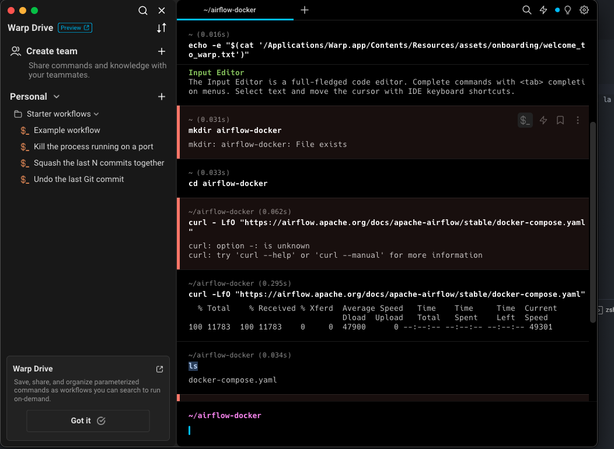
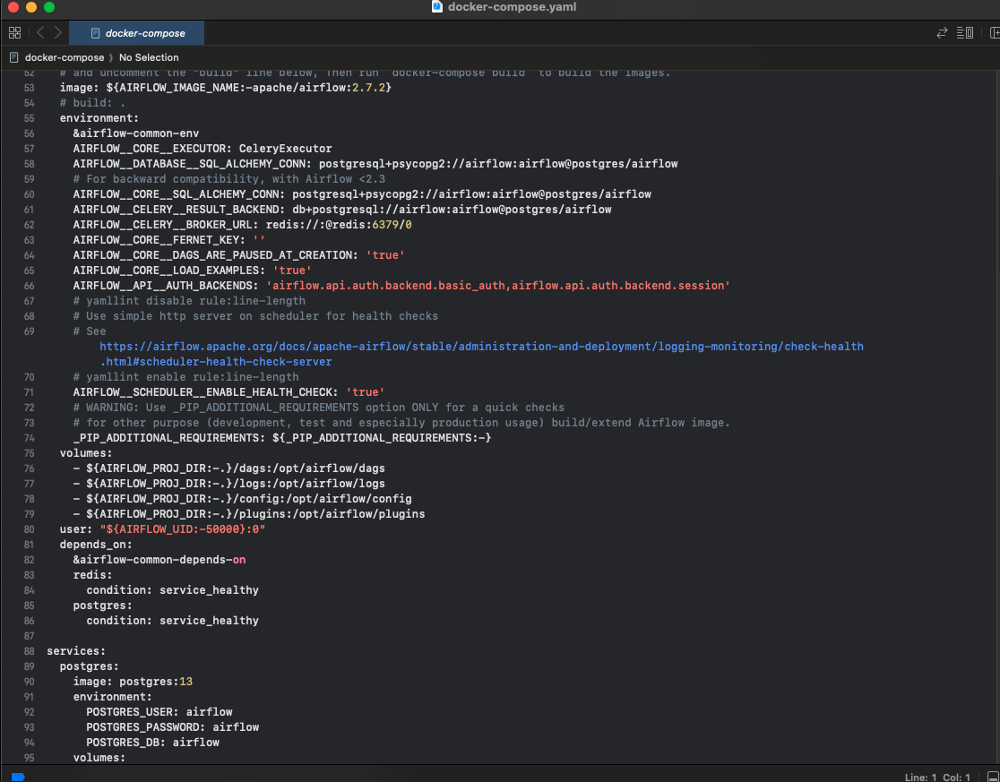
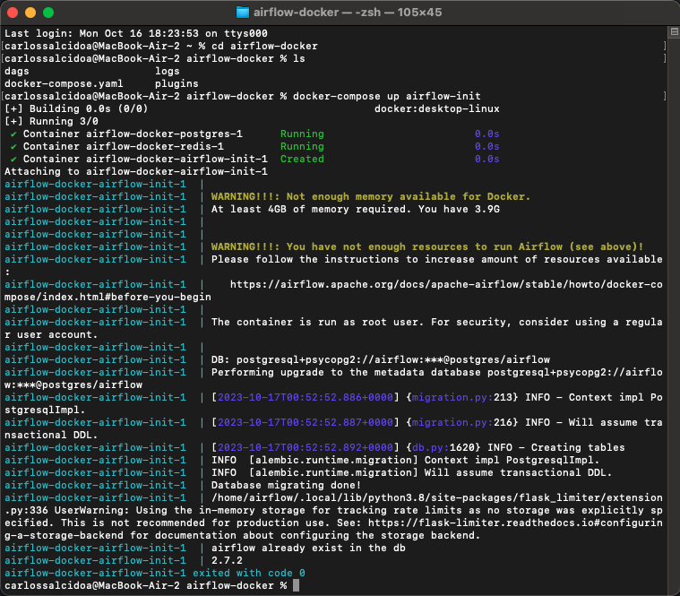
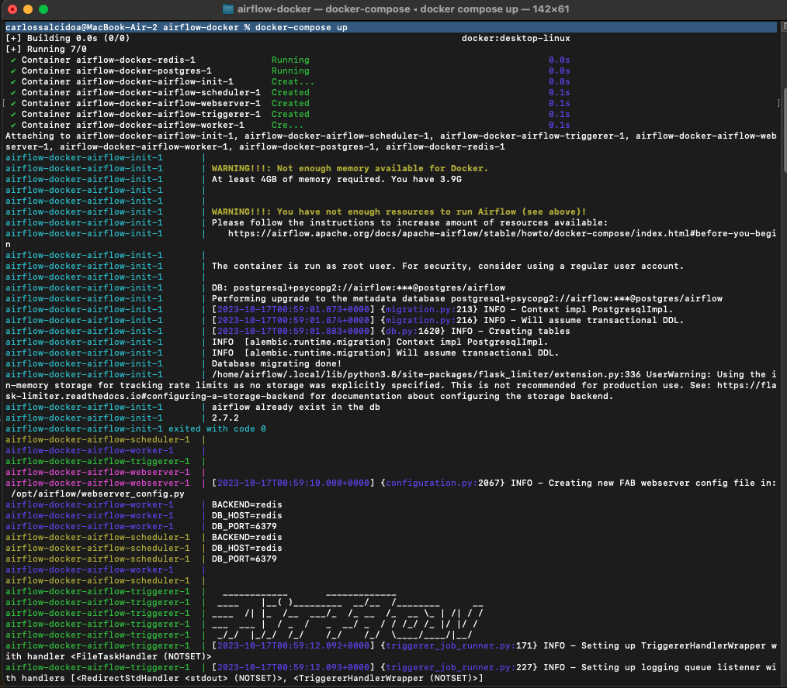
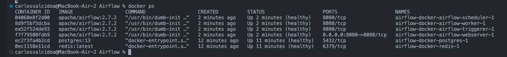
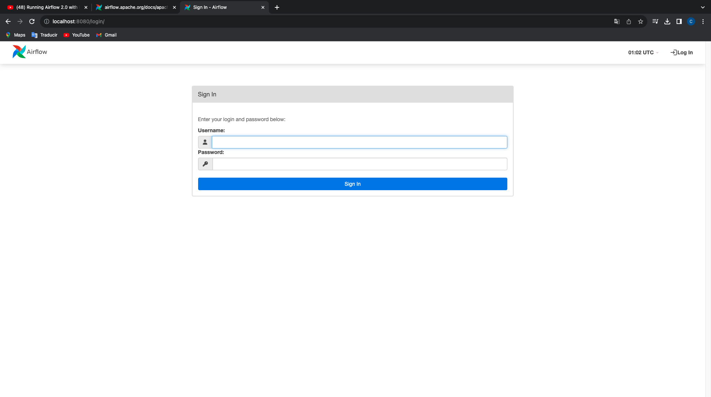
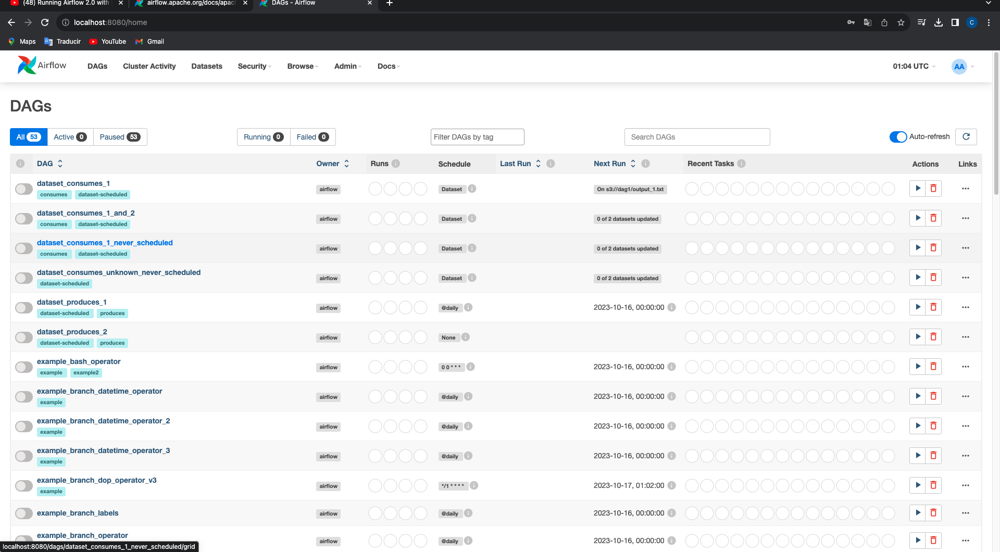
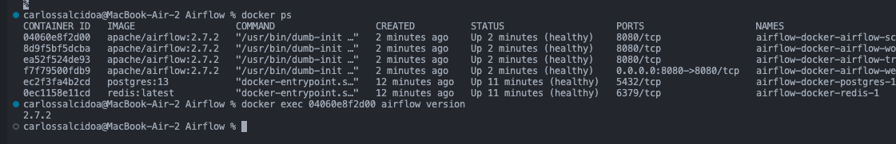

Carlos Uriel Salcido Aviña.  
217560751.  

Esta tarea es un tanto complicada, debido a la naturaleza de Airflow. Comenzamos por crear un directorio para usar el Airflow. Aquí utilizo la terminal de Wrap

Con esto podemos ver un archivo .yml que nos muestra información relacionada

Ahora se ejecuta el siguiente comando para crear un usuario Airflow con password a irflow

Ahora introducimos el siguiente comando, no puse toda lo que muestra porque es bastante. Se corren todos los servicios especificados en el archivo 'compose' local

Si escribimos 'docker ps' podremos ver todos los servicios corriendo

Si nos dirigimos al localhost:8080, veremos esta pagina.  

Como mencioné, el usuario y contraseña son 'airflow'. Nos logeamos y llegamos a esta pagina.  

Para interactuar con los containers, podemos tomar su ID y así, por ejemplo, saber su versión, usando 'docker exec'.

