Carlos Uriel Salcido Aviña.  
217560751.  

El primer paso es la instalación de Docker Desktop, no tiene ningún chiste. Ahora, utilizaremos la terminal para ejecutar algunos comandos. Comenzamos con el comando 'images' para ver las imagenes que tenemos. Como usé Airflow para la actividad anterior, esta ya aparece instalada. Ahora instalo la imagen de node, y tras su instalación, si repetimos en comando 'images', ahora también aparece node, en su última versión, ya que no especificamos ese aspecto.
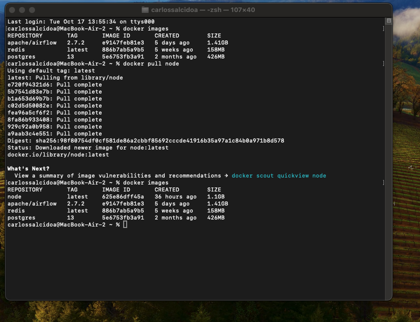

Podemos instalar distintas versiones de una misma imagen con el comando indicado.
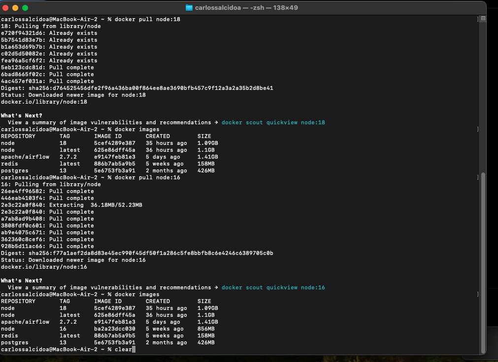

Ahora me moví a la terminal de Warp. Con este comando se pueden elminar imagenes.
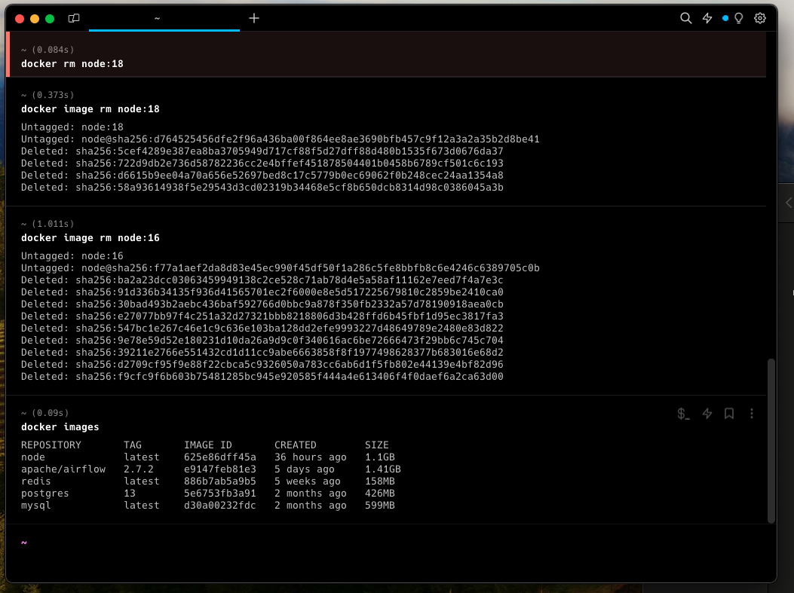

Creamos un contenedor mongo con este comando, se nos devuelve un ID importante. Con este ID, podemos iniciar el contenedor, y verificarlo con el comando 'docker ps', que nos muestra una tabla con los contenedores. Aqui se pueden ver los de Airflow que usé antes.
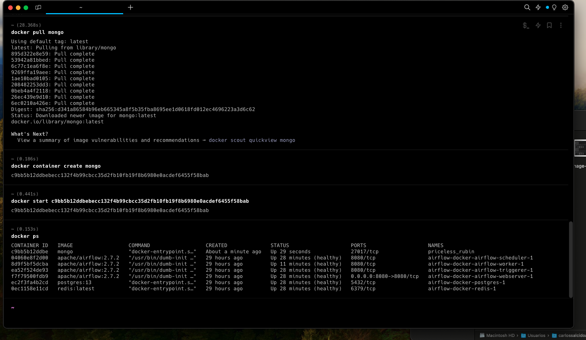

Con 'docker stop', seguido del ID, podemos detener contenedores. Aqui dejé solo mongo.
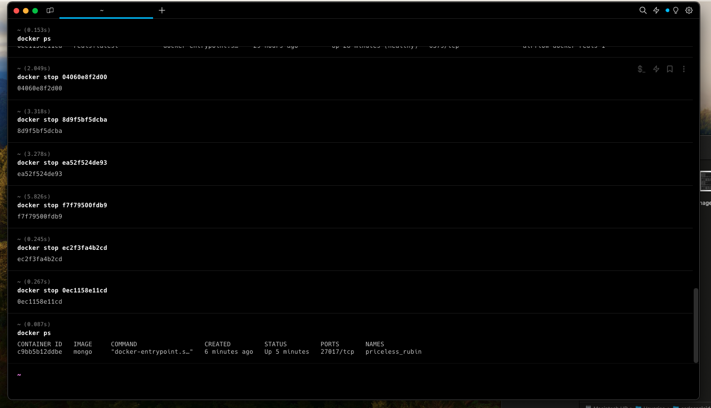

Para eliminar un docker, se usa 'docker rm ', junto con el nombre o ID del contenedor.
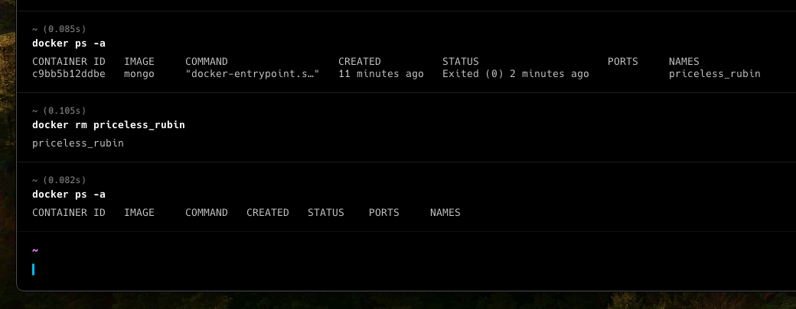

Es posible especificar el puerto que queremos asignar a un contenedor. Es mejor hacerlo, pues si no, Docker tomará la decisión, y suele tomar malas decisiones.
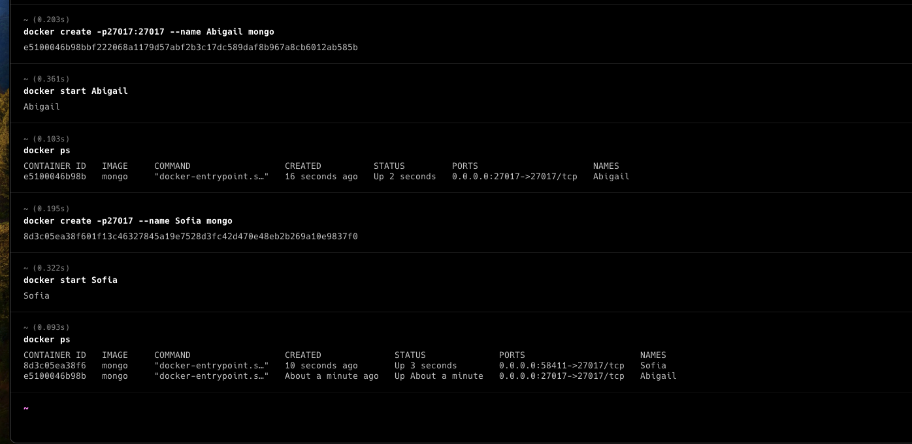

El comando 'docker run' encuentra una imagen que necesitemos, y si no la tenemos, la descarga, luego crea un contenedor, y luego lo inicia.
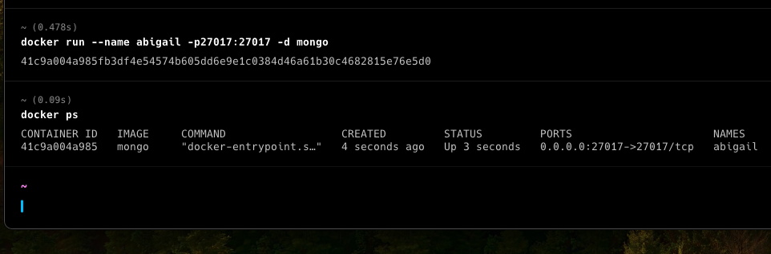

Ahora podemos crear una aplicación usando JavaScript. Primero creamos un container de nombre 'sofia', donde incluimos sus puertos, nombres, USERNAME y PASSWORD de la base de datos y establecemos que usaremos mongo.
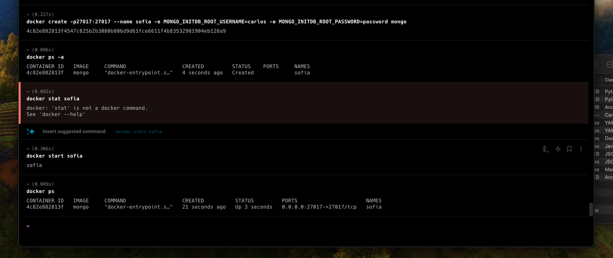

Utilizamos este codigo de Java Script, el cual, al acceder al puerto 3000 del localhost, muestra todos los animales creados. Para crear animales, hay que añadir '/crear/', nos mostrará el mensaje 'ok'
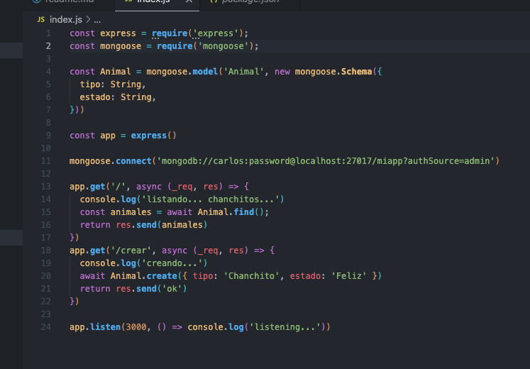

No muestra nada porque no hemos creado animales.
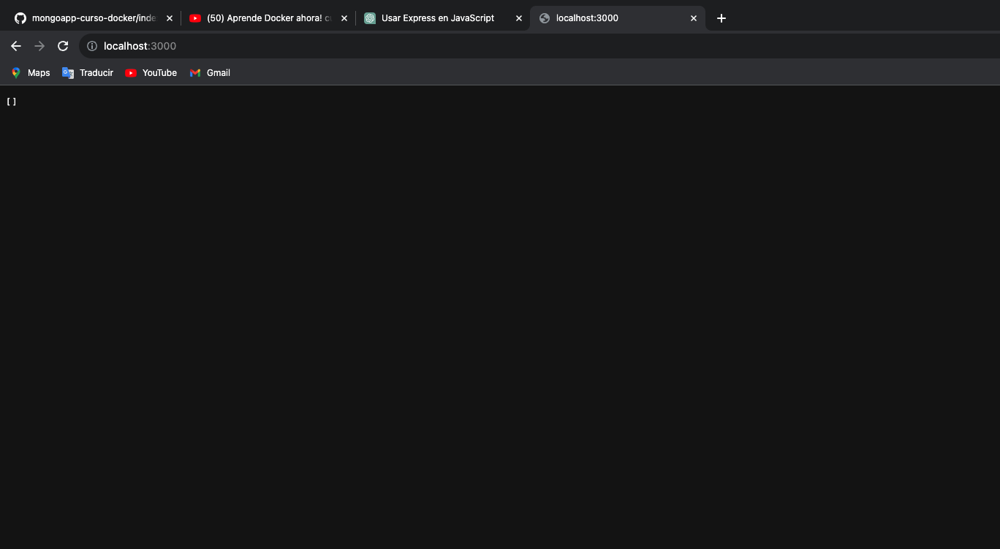

creamos uno.
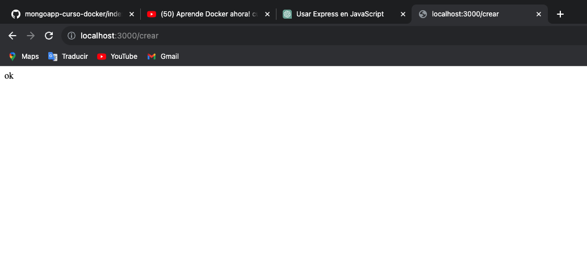

Y volvemos al inicio, yo hice dos. Podemos ver ambos chanchitos con su ID y estado 'Feliz'
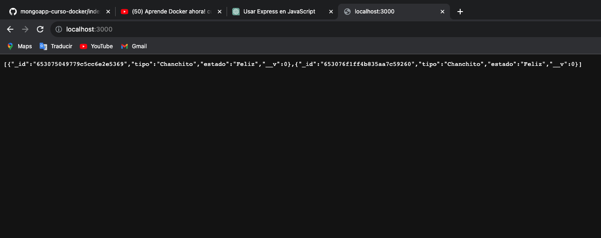

Mientras tanto, la terminal muestra esto:
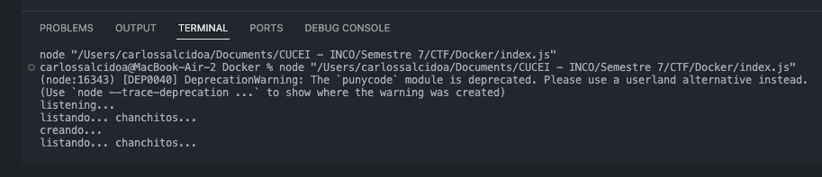