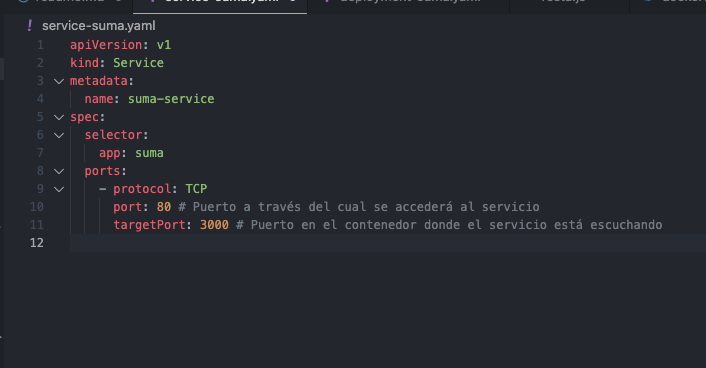

Carlos Uriel Salcido Aviña.  
217560751.  

Para esta práctica utilizaremos el mismo proyecto de Microservicios, pero agregando kubernetes. Comenzaremos por crear dos archivos yaml por cada función de nuestra calculadora. Este primero es para el deployment de la función 'suma'

El segundo es para el service de la función 'suma'. Como mencioné, haremos estos dos archivos para cada función.

Antes de continuar, tenemos que asegurarnos de tener activados los kubernetes desde docker desktop. Si no estaban instalados, comenzará la instalación.

Para asegurarnos de que kubernetes está corriendo, utilizamos el comando kubectl. Esto comprabará el estado del kluster.

Ahora solo hace falta aplicar el servicio de kubernetes a los archivos que hemos creado.

Ahora podemos comprobar el estado de los servicios con el siguiente comando.

Y con el siguiente.

