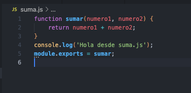
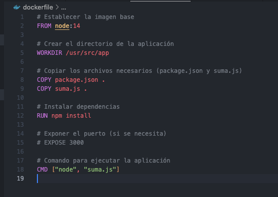
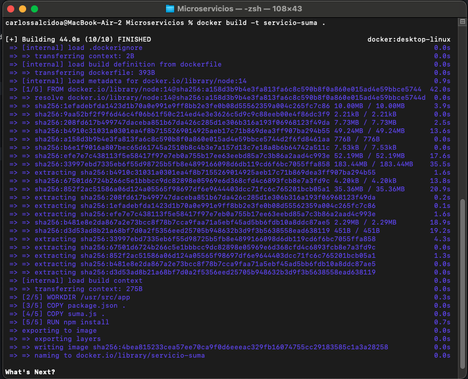
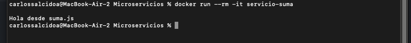
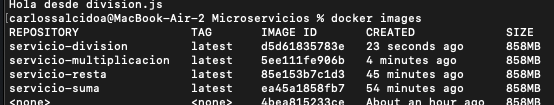

Carlos Uriel Salcido Aviña.  
217560751.  

El objetivo será crear una calculadora, donde cada operación represente un servicio difente. Para ello usaremos javascript. Esta es la función suma.

Ahora debemos crear el dockerfile. El archivo package.json no es importante, solo lo agregué para la función suma.

Con estos dos archivos, podemos construir la imagen docker. Es importante notar que debemos estar desde la terminal, en la carpeta donde tenemos estos archivos. La imagen se llama 'servicio-suma'

Con este comando podemos ejecutar el archivo, de momento solo mostrará lo que se imprime en consola. Ya tenemos el primer servicio. Tendremos que hacer esto mismo para multiplicacion, division y resta.

Finalmente, habremos logrado tener un servicio para cada función de la calculadora. Aquí podemos ver las imagenes docker. Para este punto, ya hemos cumplido con la creación de una arquitectura de microservicios.

Para este punto ya podríamos comenzar a planificar dónde y cómo visualizar esta calculadora, pero mis esfuerzos ahora irán dirigidos hacia el proyecto final, donde con toda probabilidad sí haremos esta implementación.