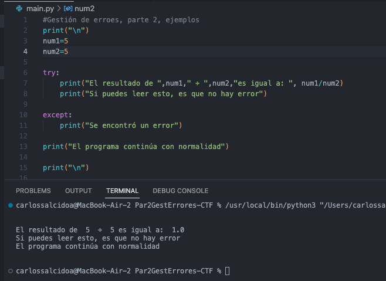
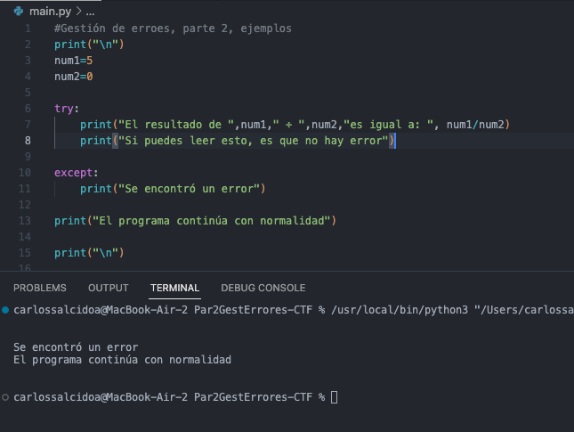
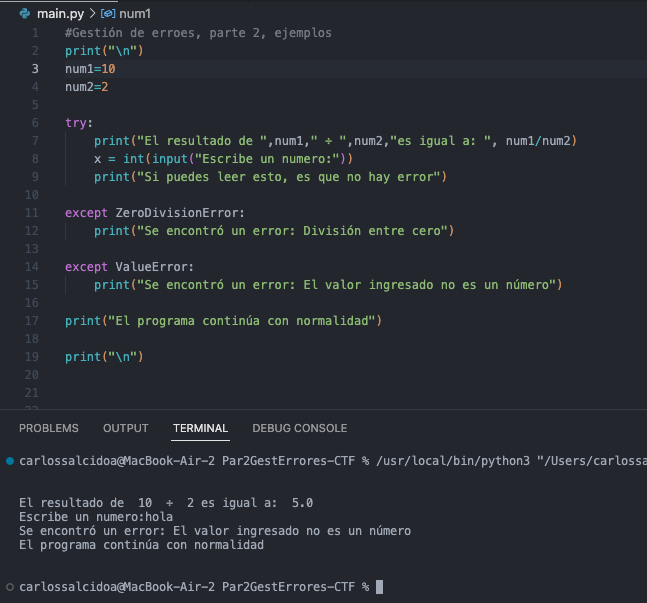
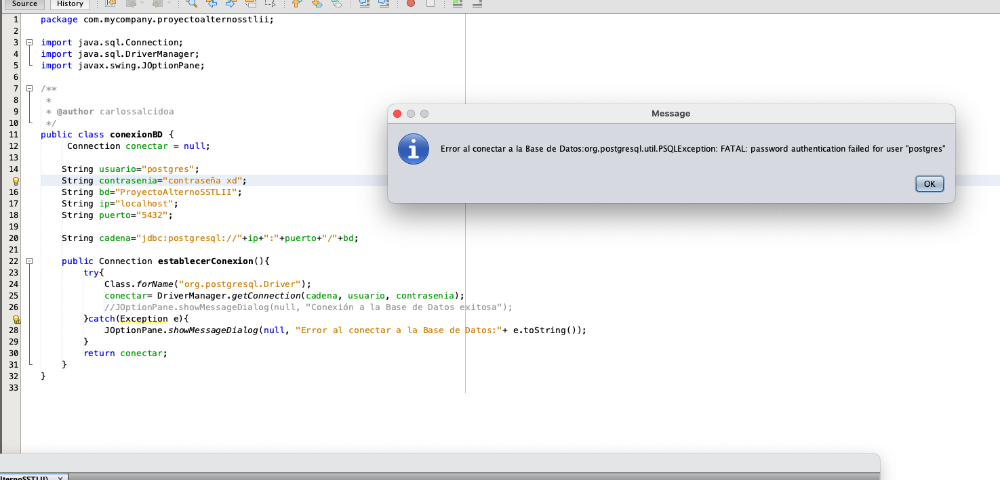

Carlos Uriel Salcido Aviña
217560751

En este primer ejemplo se puede ver cómo se intenta hacer una división de 5 entre 5, el programa se ejecuta sin problemas. No se ejecuta el except.

Con este mismo código, podemos provocar una división entre cero, lo cuál genera un error. Para evitarlo, el except se da cuenta del error y se ejecuta su código.

Tabmién podemos especificar los tipos de errores que estamos buscando. En este ejemplo hay excepciones para la división entre cero y valores inválidos

Por último quiero agregar un ejemplo del try-catch de java,con un proyecto que ya había hecho antes. No voy a adjuntar el proyecto porque está muy pesado, pero aquí está el enlace:https://github.com/DankerVV/SSTLII/tree/main/ProyectoAlternoSSTLII
Lo que sucede en la imagen es que cambié la contraseña de la base de datos, de forma que se genera y se atrapa un error, el cual posteriormente y dentro del catch, se tiene la instrucción de que genere una ventana e imprima el error encontrado. El programa puede continuar, pero es recomendable cerrarlo y solucionar dicho error.

