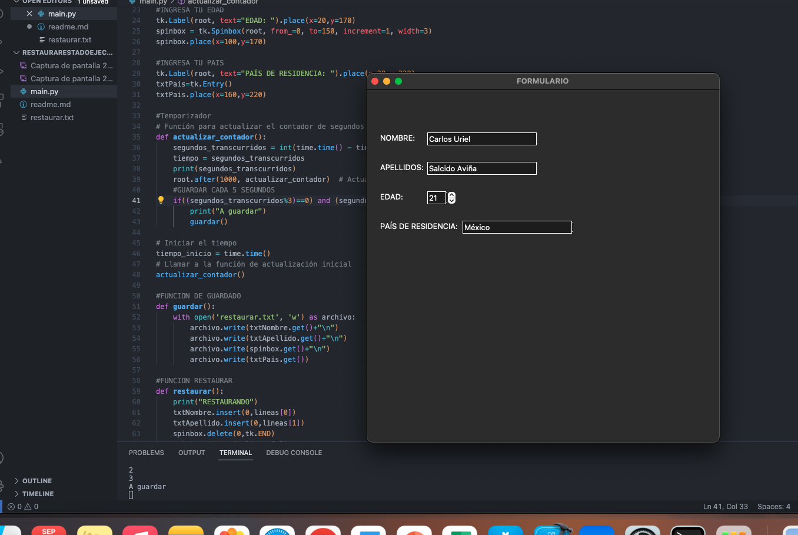

Carlos Uriel Salcido Aviña
217560751.

Este programa es un formulario que guarda de forma automática la información cada 3 segundos, para ello, se utiliza un temporizador, y cada que la variable de tiempo es un multiplo de 3, se toman los datos de los text field y se guardan en un archivo de texto.

 18.17.32.png>)

Aqui se ve como el archivo de texto está vacío, y mientras lo llenamos con información, se guardan los datos en el txt.

 18.17.59.png>)

Por último, cerramos y abrimos el programa de nuevo, abajo se puede ver que el temporizador acaba de empezar y ta tiene los datos.

