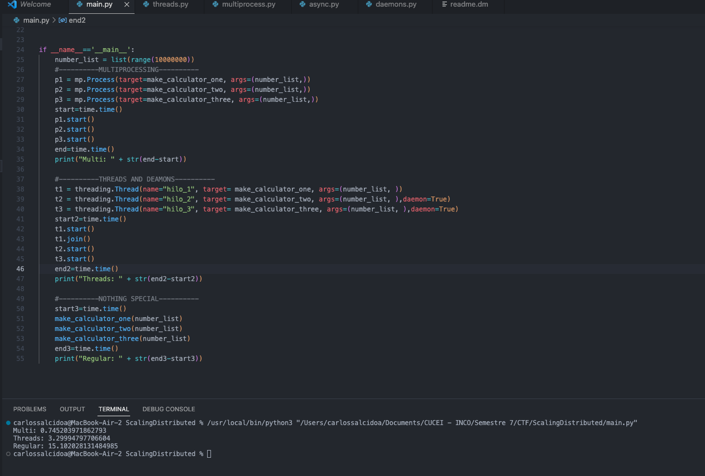

Carlos Uriel Salcido Aviña.  

217560751.  

Para familiarizarme con estos términos, decidí investigarlos por separado, y hacer un ejercicio de cada uno, para poder aprender más sobre cómo funcionan.  

En el primer ejemplo, hay dos funciones, la primera hace esperar dos segundos, y la segunda, cinco. En esta imagen se puede ver como el tiempo total de ejecución es de 7 segundos para terminar el programa.  

.  
Sin embargo, si utilizamos los threads, ahora el tiempo total de ejecución son cinco segundos, debido a que no esperamos a que termine la primera función para iniciar la segunda, ambos hilos empiezan al mismo tiempo.  

El siguiente código muestra el funcionamiento de un demonio. Aquí se imprime un número cada 0.5 segundos, sin embargo, al tratarse de un demonio, el programa principal puede finalizar aún si no se ha terminado la ejecución.  

.  
Por otro lado, si hacemos que el programa espere dos segundos antes de terminar, el demonio tendrá tiempo para mostrar cuatro números.  

Para el ejemplo del multiprocessing, hay tres funciones, que se encargan de hacer una operación con raíz cuadrada y potencia. Llamamos a estas tres funciones con multiproceso y de forma normal, cada función se ejecuta 10 millones de veces, la idea es hacer que el procesador tarde un rato, y poder apreciar las diferencias de tiempo entre cada método. Se puede ver cómo el múltiprocesador logra resolver las operaciones en menos de un segundo, mientras que, si llamamos a cada función por separado, nos toma casi 10 segundos.

El ejemplo de concurrencia es este código. Aqui se puede ver cómo se juega con los tiempos, y aunque en la imagen no se vea, suceden las pausas correspondidas en cada momento, y eso, junto con el momento en que se manda a llamar la segunda función, influyen en el orden de impresión.  

Por último, decidí tomar el ejemplo que utilicé para el multiprocessing, pero añadiendo hilos, dos de ellos siendo demonios, para poder comparar la velocidad de cada método. Aqui se apreia como el multiprocessing es el más rápido, y simplemente llamar a la función sin usar nada es la forma menos efectiva de resolver las funciones.
