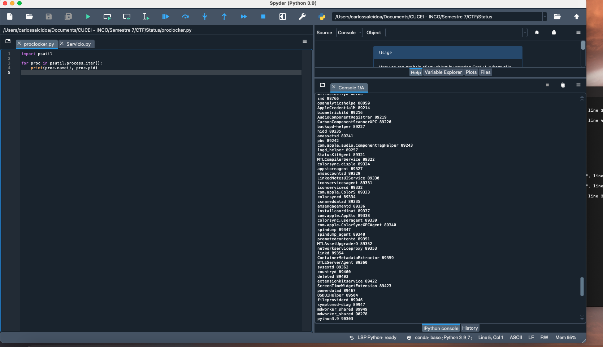

Carlos Uriel Salcido Aviña.  
217560751.  

Para esta tarea, tengo dos códigos muy sencillos, ambos basados en los que nos proporcionaba la página compartida en la sección de tarea.  El primero simplemente imprime en la terminal todos los servicios que se están ejecutando mientras se ejecuta el código, usando la librería psutil.

El segundo código busca un servicio que hayamos ingresado desde la terminal, y si se está ejecutando, lo cierra.  Para este ejemplo, mando desde la terminal que quiero cerrar el bucador "Safari".  

Una vez ejecutada la instrucción, la aplicación Safari se cierra, como puede apreciarse en la captura.  

El siguiente ejemplo ocurre con la propia terminal, pues desde la terminal vamos a indicar que queremos cerrarla.

