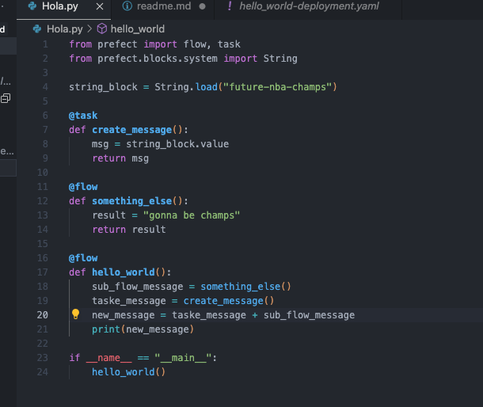
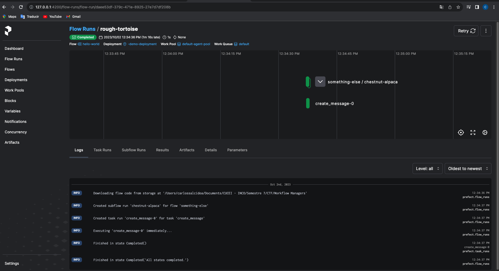
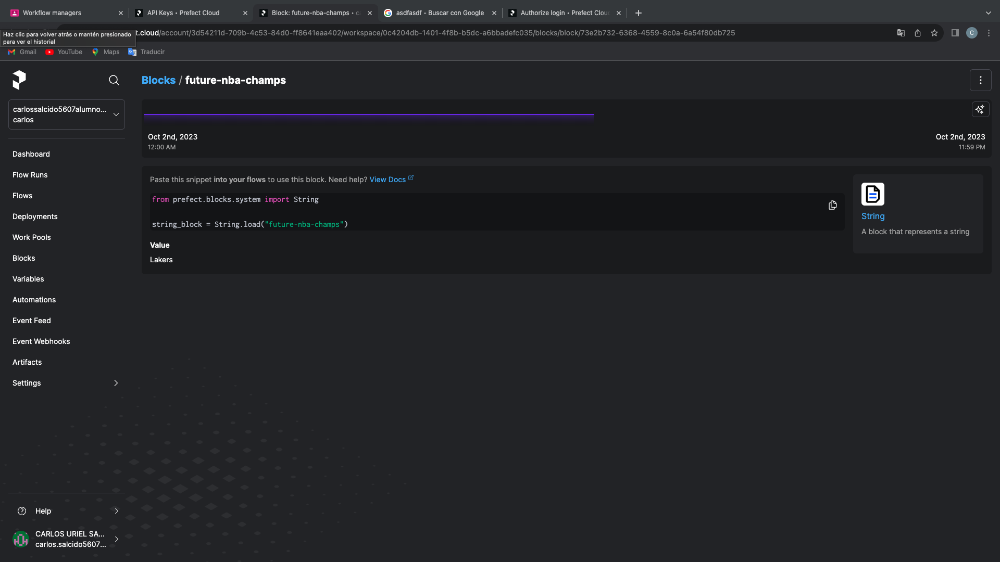
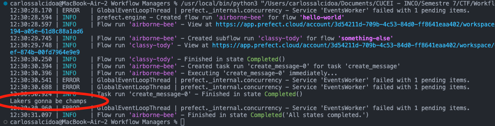
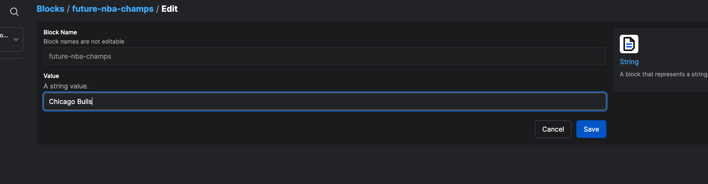
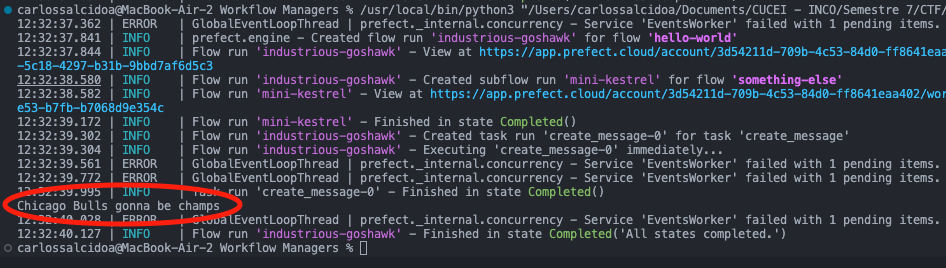

Carlos Uriel Salcido Aviña.  

Este tema me resutló algo complicado de entender al principio, debido a que prefect es una librería muy diferente a lo que estoy acostumbrado a utilizar en Python. Tuve el problema de que el tutorial proporcionado por el profesor me venía con algunos problemas que no se explicaban directamente, por lo que seguí este tutorial: https://www.youtube.com/watch?v=D5DhwVNHWeU .  

Lo que viene en este reporte es lo que seguí con dicho tutorial, pues considero que viene muy completo. El código final es este:  

Suceden cosas muy interesantes. Con prefect podemos manipular y ver cómo funciona cada task, subtask y flow, gracias a las herramientas externas que nos proporciona la librería. Puede ser de forma local:  

O utilzando el servidor de la nube de prefect:  

Lo que hace el código es que puede recibir parámetros desde prefect cloud, como se muestra en la imgagen anterior, desde la nube podemos declarar la cadena 'Lakers', y ya en el código, utilizando flows, subflows y task, añadimos el texto 'gonna be champs'.  

Si desde la nube editamos el texto a 'Chicago Bulls':  

Podremos correr el código de nuevo, y la impresión cambiará según el texto que hayamos puesto desde la nube:

Esta es una herramienta muy útil que permite trabajar en conjunto de manera más ágil, aprovechando la tecnología de la nube. A parte, también cuenta con sincornización para GitHub, Azure, AWS, etc.